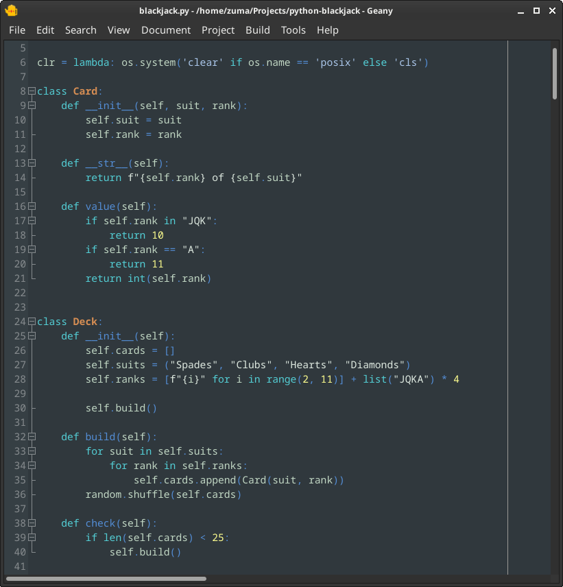

## Carmanah for Geany IDE

A beautiful dark theme inspired by the ancient Pacific rainforest.

Download the configuration file and save it to the folder `colorschemes` in your Geany configuration directory (usually `~/.config/geany/colorschemes/`).

Geany IDE - https://www.geany.org/
